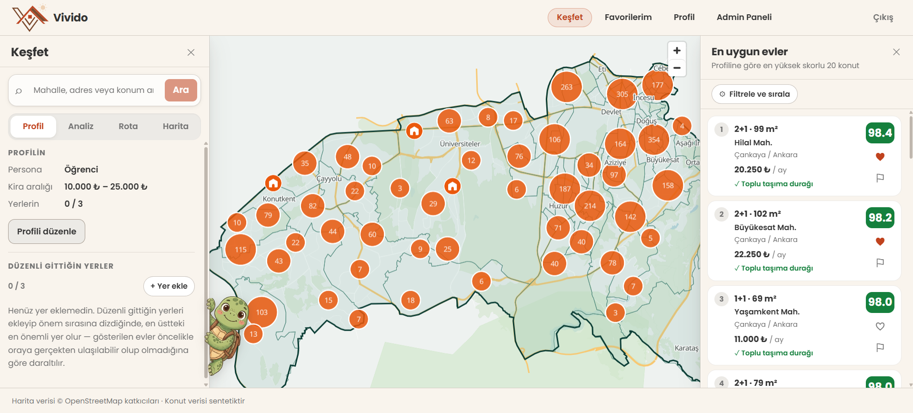
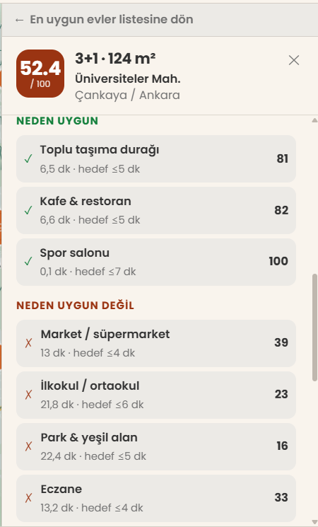
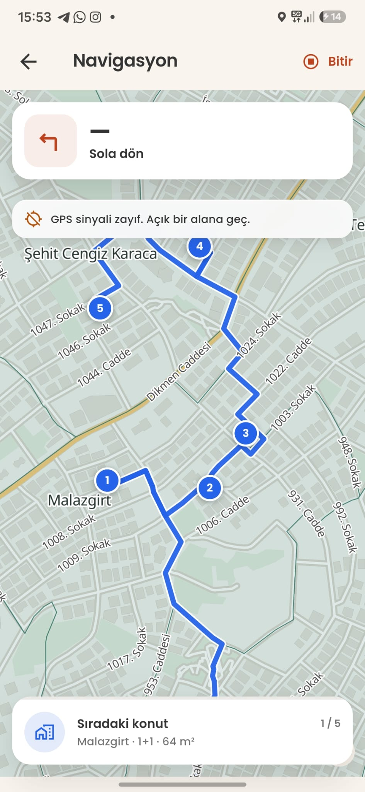
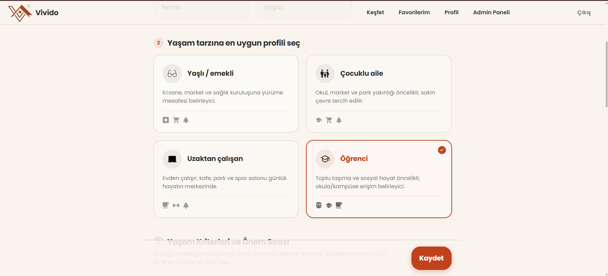
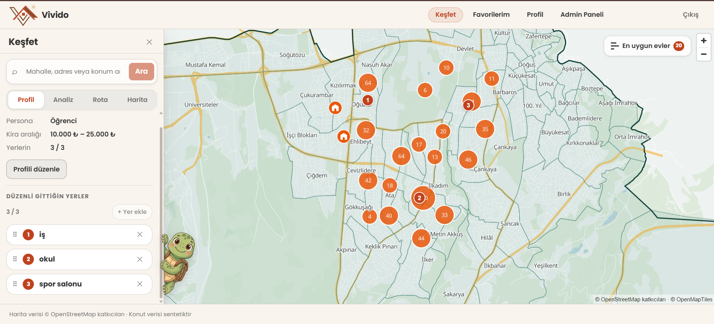
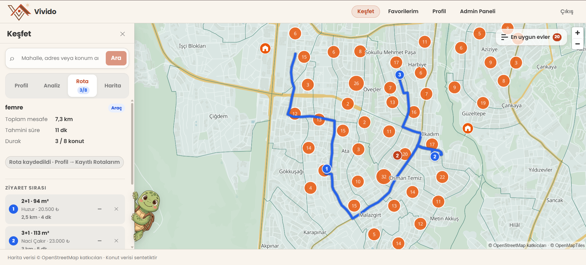

<div align="center">


# Vivido

### Bütçene değil, **hayatına** uyan kiralık evi bul.

Vivido her kiralık ilanı **senin gittiğin yerlere** göre puanlar, bu puanın
gerekçesini satır satır açıklar ve seçtiğin evleri gezmek için en kısa rotayı
kurar.

<!-- ── DEMO BLOĞU — demo sunucusu kapandığında bu satırları silin ── -->
[**Canlı demo →**](https://vividoapp.xyz) &nbsp;·&nbsp; [🇬🇧 English](README.md) &nbsp;·&nbsp; [Dokümantasyon](docs/)

<sub>Bakmak için hesap gerekmiyor — **“Misafir olarak devam et”** deyin.<br />
Demo geçici bir sunucuda duruyor ve ileride kapatılacak. Aşağıdaki ekran
görüntüleri tüm ekranları kapsıyor; proje ayrıca tek bir `docker compose`
komutuyla yerelde ayağa kalkıyor — bkz. [kendin çalıştır](#kendin-çalıştır).</sub>
<!-- ── DEMO BLOĞU SONU — sildikten sonra dil/doküman bağlantılarını koruyun: ──
[🇬🇧 English](README.md) · [Dokümantasyon](docs/)
-->


<br />


</div>

---

## Sorun

Her emlak sitesi fiyata, metrekareye ve oda sayısına göre filtrelemene izin
verir. Hiçbiri asıl merak ettiğin soruyu cevaplamaz:

> *"Burada otursam günlük hayatım nasıl olur?"*

%15 daha ucuz bir daire; en yakın durak yokuş yukarı 25 dakikaysa, eczane
bulvarın öbür tarafındaysa ve çocuğun okulu şehrin diğer ucundaysa iyi bir
anlaşma değildir. Bu maliyetler gerçektir, **her gün** ödenir ve hiçbir ilan
sayfasında yazmaz.

**Vivido bu günlük hayat sorusunu karşılaştırabileceğin bir sayıya çevirir** —
ve daha önemlisi, itiraz edebileceğin bir gerekçeye.

---

## Nasıl çalışır

<table>
<tr>
<td width="50" align="center"><h3>1</h3></td>
<td><b>Kim olduğunu söyle</b><br />
Dört hazır profilden birini seç — öğrenci, çocuklu aile, uzaktan çalışan ya
da emekli — ve aylık kira bütçeni gir. Her profil neyin önemli olduğuna dair
bir başlangıç noktasıyla gelir: öğrenci için toplu taşıma ve kafeler ağır
basar, çocuklu aile için okul ve park.</td>
</tr>
<tr>
<td align="center"><h3>2</h3></td>
<td><b>Düzenli gittiğin yerleri ekle</b><br />
Kampüsün, ofisin, ailenin evi. Bunlardan en fazla üç tane — <i>anchor</i> —
ve hangisinin daha önemli olduğunu sıralayarak. Vivido'yu genel bir
"mahalle puanı"ndan ayıran şey tam olarak bu: harita ortalama bir insana
göre değil, <i>senin</i> hayatına göre puanlanıyor.</td>
</tr>
<tr>
<td align="center"><h3>3</h3></td>
<td><b>Haritanın kendini puanlamasını izle</b><br />
Her ev tek bir <b>0–100</b> puan alır. Yüksek puanlılar da düşük puanlılar da
gösterilir — kötüleri gizlemek zaten sadece bir filtre olurdu. Herhangi bir
eve tıklayınca o puanı <i>neden</i> aldığını görürsün.</td>
</tr>
<tr>
<td align="center"><h3>4</h3></td>
<td><b>Gezme gününü planla</b><br />
2–8 ev seç, Vivido hepsini dolaşan en kısa rotayı hesaplasın; rota mobil
uygulamaya geçsin ve ev gezme günü adım adım navigasyonla yönlendirsin.</td>
</tr>
</table>

---

## Ekran görüntüleri

<div align="center">



**Haritadaki her ev puanını üstünde taşır.** Solda profilin, sağda en uygun
evler sıralı. Alt şeride dikkat: harita veri atfı ve *"konut verisi
sentetiktir"* etiketi her zaman görünür.

<br />

<table>
<tr>
<td width="50%" align="center"></td>
<td width="50%" align="center"></td>
</tr>
<tr>
<td align="center"><b>Bu puan neden</b><br /><sub>Her kriter, gerçekten ölçülen yürüme süresiyle hedefin karşısında. Bu ev <b>52,4</b> almış — düşük puanlılar gizlenmiyor, gösteriliyor.</sub></td>
<td align="center"><b>Mobil navigasyon</b><br /><sub>Manevra kartı, numaralı duraklar ve sıradaki konut. GPS sinyali zayıfken uygulama bunu söylüyor — sessizce yanlış konum göstermiyor.</sub></td>
</tr>
</table>

<br />



**Hayatına en yakın profili seç.** Her biri neyin önemli olduğuna dair farklı
bir başlangıç noktasıyla gelir — alttaki adımda o kriterleri kendin de
yeniden sıralayabilirsin.

<br />



**Düzenli gittiğin yerler, önem sırasıyla.** İş, okul, spor salonu —
senin için önemli sıraya sürüklenmiş. Harita bunların etrafında yeniden
puanlanır.

<br />



**Gezi rotası.** Sekiz olası evden üçü seçilmiş, aralarındaki en kısa yol
haritaya çizilmiş; toplam mesafe ve süre panelde.

</div>

---

## Puana neden güvenilir

Çoğu "yürünebilirlik" puanı kuş uçuşu hesaplanır. Bu hızlıdır ve yanlıştır:
300 m ötede ama altı şeritli, yaya geçidi olmayan bir bulvarın karşısındaki
park, 4 dakikalık yürüyüş değildir.

Vivido süreleri **gerçek sokak ağı üzerinde** ölçer; OpenStreetMap verisi
üzerinde çalışan bir rota motoruyla. Aradaki fark akademik değil: kuş uçuşu
mesafeden gerçek rotalamaya geçildiğinde ölçülen süreler ortalama **1,37 kat**
arttı. Yani eski yöntemle hesaplanan her skor, gerçeğinden yaklaşık üçte bir
oranında iyimserdi.

Skor motorunun bilerek yaptığı dört şey daha:

| | |
|---|---|
| **Hesabını gösterir** | Her skorun yanında satır satır bir tablo gelir: hangi kriter, ne ölçüldü, hedef neydi ve puana tam olarak kaç puan kattı. Satırların toplamı toplam skora eşittir — bunu gelenek değil, bir birim testi zorlar. |
| **Kırmızı çizgiyi ortalamaya boğmaz** | Yedi konuda mükemmel, ama senin "en önemli" dediğin tek konuda umutsuz olan bir ev, rahat bir ortalama almaz. "Zayıf halka" cezası tüm skoru aşağı çeker — hem de o kriteri ne kadar önemsediğinle orantılı olarak. |
| **Olmadığı kadar kesin davranmaz** | Markete 50 m ile 500 m aynı şey değil; bu yüzden skor "ideal" bölgenin içinde bile hafif bir eğim korur. Bu değişiklikten önce **767 ev** tam 100 puanda eşitlenmişti. |
| **Bütçeyi uyumdan ayırır** | Kira skorun yanında gösterilir, asla içine katılmaz. Aksi halde bir evin düşük puan almasının sebebinin "her şeye uzak" mı yoksa sadece "pahalı" mı olduğunu ayırt edemezdin. |

---

## Özellikler

### Web

| | Özellik |
|---|---|
| ✅ | E-posta doğrulamalı kayıt, şifre sıfırlama |
| ✅ | **Misafir modu** — hesapsız harita gezintisi |
| ✅ | Profil: dört personadan biri + aylık kira bütçesi |
| ✅ | En fazla 3 "önemli konum", sürükle-bırakla önem sıralaması |
| ✅ | Gerçek Çankaya haritası — sokak, bina, su, yeşil alan, 124 mahalle |
| ✅ | Haritada ve sıralı listede 0–100 puanlı evler |
| ✅ | Satır satır skor gerekçesi, güçlü ve zayıf yönler |
| ✅ | Açılıp kapanabilen POI katmanları (8 kategori) |
| ✅ | Alan analizi — haritada çember çiz, içindeki hizmet noktalarını gör |
| ✅ | Favoriler ve eve özel kişisel notlar |
| ✅ | 2–8 ev için gezi rotası, kaydetmeden önizleme, isteğe bağlı tarih planı |
| ✅ | Mahalle, adres veya yer adına göre konum arama |
| ✅ | Admin paneli — kullanıcı yönetimi, sistem sağlığı, kullanım metrikleri |

### Mobil (Flutter)

| | Özellik |
|---|---|
| ✅ | Web ile aynı hesap |
| ✅ | Kayıtlı rotalar listesi |
| ✅ | Haritada rota çizgisi + numaralı ev durakları |
| ✅ | Adım adım navigasyon: manevra kartları, canlı GPS, otomatik adım ilerlemesi, rotadan sapma uyarısı |
| ✅ | Her durakta ev skor kartı, "ziyaret ettim" işaretlemesi |
| ✅ | Çevrimdışı çalışabilen oturum ve önbelleklenmiş favoriler |

---

## Veri

Vivido, pilot bölge **Ankara Çankaya** için OpenStreetMap'ten üretilmiş
gerçek bir coğrafi veri kümesi üzerinde çalışır:

| | |
|---|---|
| **124** | mahalle, gerçek sınırlarıyla |
| **8** | ilgi noktası kategorisi: market, eczane, toplu taşıma durağı, kafe & restoran, park, spor salonu, okul, sağlık |
| **~48.000** | konut ile çevresindeki hizmetler arasında önceden hesaplanmış yürüme süresi |
| **~6.000** | kiralık konut ilanı |

> ### ⚠️ İlanlar sentetiktir
> 6.000 konut **üretilmiştir**, gerçek bir ilan sitesinden çekilmemiştir.
> Kira, metrekare ve oda sayısı her mahalle için istatistiksel olarak
> inandırıcı olacak şekilde modellenmiş ve her konut gerçek bir bina
> poligonunun üzerine yerleştirilmiştir — ama hiçbiri gerçek bir ilan değildir.
>
> Bu bilinçli bir tercihtir ve uygulama ilan gösterdiği her yerde bunu açıkça
> etiketler. Coğrafya, yürüme süreleri ve skorlama gerçektir; yalnızca ilanlar
> temsilîdir.

---

## Kullanılan teknolojiler

| Katman | Teknoloji |
|---|---|
| **API** | .NET 10 · ASP.NET Core · Entity Framework Core |
| **Veritabanı** | PostgreSQL + PostGIS |
| **Rotalama** | OSRM (yaya ve araç profilleri) — gerçek seyahat süreleri için |
| **Web** | React 19 · TypeScript · Vite · MapLibre GL JS · TanStack Query · Zustand |
| **Mobil** | Flutter · MapLibre |
| **Harita karoları** | Kendi sunucumuzda vektör karolar (Planetiler → tileserver-gl) — üçüncü taraf karo servisi yok |
| **Veri boru hattı** | osm2pgsql · Python · OSRM · SQL |
| **Altyapı** | Docker Compose · Caddy (otomatik HTTPS) · GitHub Actions |

Skor motoru **saf, bağımlılıksız bir C# kütüphanesidir** — veritabanı yok,
HTTP istemcisi yok, saat yok. Girdi alır, skor döndürür. Bu sayede tüm
motor, hiçbir altyapı ayakta olmadan, milisaniyeler içinde yüzlerce vakaya
karşı test edilebiliyor.

---

## Projenin durumu

Bu proje **Başarsoft** stajı kapsamında, başta bilerek dondurulmuş üç
haftalık bir kapsamla geliştirildi — kapsam şişmesi projenin 1 numaralı riski
olarak belirlenmişti, bu yüzden yeni fikirler yol ortasında eklenmek yerine
bir backlog'a park edildi.

Yukarıdaki özellik tablolarındaki her şey **çalışıyor ve yayında**. Yapılmamış
olanların — bilinen eksikler, teknik borç ve kesilen özelliklerin — dürüst
listesi de açıkta duruyor:
[`docs/04-MEVCUT-DURUM.md`](docs/04-MEVCUT-DURUM.md). Aynı doküman yol boyunca
bulunan her gerçek hatayı ve nasıl teşhis edildiğini de kaydediyor — muhtemelen
daha ilginç olan kısım orası.

---

## Kendin çalıştır

Demo sunucusu geçici, ama proje ona bağlı değil. Veritabanı, rota motorları,
harita karo sunucusu, API ve web uygulaması — hepsi Docker Compose'da tanımlı.
Hazırlanmış ~1 GB'lık harita verisi de GitHub release'i olarak yayınlanıyor,
yani kimsenin saatler süren veri boru hattını yeniden çalıştırması gerekmiyor.

```bash
git clone https://github.com/faygun21/vivido.git && cd vivido
./data/scripts/00_fetch_artifacts.sh        # hazır harita + rota verisi
cp .env.example .env && cp web/.env.example web/.env
docker compose --profile full up -d         # her şey, tek komut
```

Docker'sız geliştirme döngüsü dahil tüm adımlar:
[`docs/KURULUM.md`](docs/KURULUM.md).

---

## Dokümantasyon

| Doküman | İçeriği |
|---|---|
| [`docs/KURULUM.md`](docs/KURULUM.md) | **Kurulum rehberi** — tüm yığını kendi makinende çalıştır |
| [`docs/04-MEVCUT-DURUM.md`](docs/04-MEVCUT-DURUM.md) | Bugün gerçekten ne çalışıyor, bulunan/düzeltilen her hata, bilinen borç |
| [`docs/02-KARARLAR.md`](docs/02-KARARLAR.md) | Karar defteri — 18 mimari karar, gerekçeleri *ve* reddedilen alternatifleriyle |
| [`docs/01-PROJE-PLANI.md`](docs/01-PROJE-PLANI.md) | Tam teknik tasarım: skorlama matematiği, veri modeli, API sözleşmesi |
| [`docs/00-KAPSAM.md`](docs/00-KAPSAM.md) | Kapsam sözleşmesi — neyin içeride, neyin açıkça dışarıda olduğu |
| [`data/README.md`](data/README.md) | ETL boru hattı, baştan sona |
| [`deploy/README.md`](deploy/README.md) | Dağıtım ve sunucu kurulumu |
| [`CONTRIBUTING.md`](CONTRIBUTING.md) | Branch, commit ve PR kuralları |

---

## Lisans ve atıf

Harita verisi © [OpenStreetMap](https://www.openstreetmap.org/copyright)
katkıcıları, **ODbL 1.0** ile lisanslıdır. Vektör karolar Planetiler ile
OpenMapTiles şeması kullanılarak üretilmiştir (**CC-BY**). Her iki atıf da web
ve mobil uygulamada harita üzerinde **görünür** durur ve kapatılamaz — bu bir
tasarım tercihi değil, lisans gereğidir.

Kiralık konut ilanları sentetiktir ve arayüzün her yerinde bu şekilde
etiketlenir.
